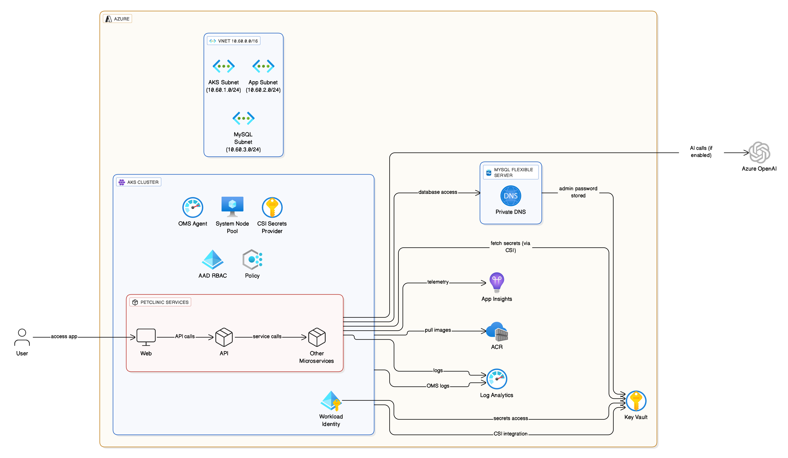
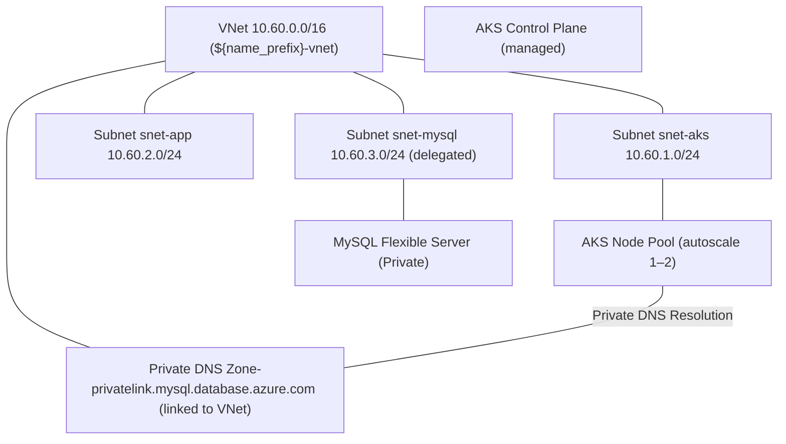
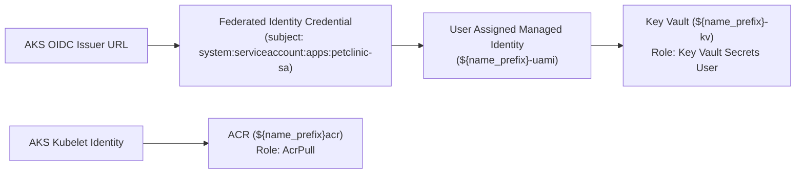
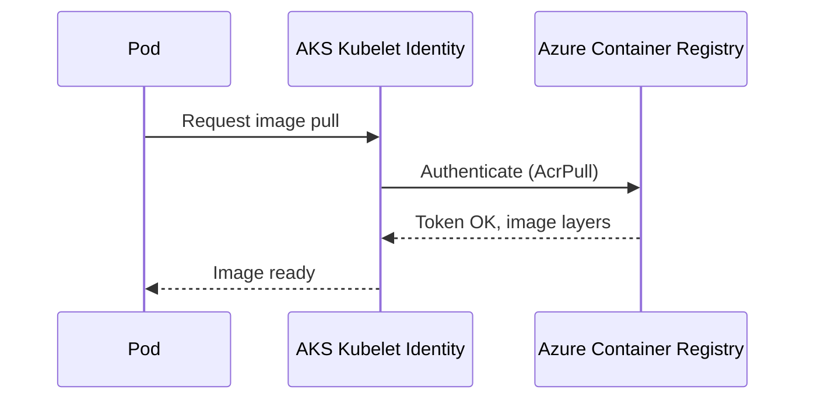
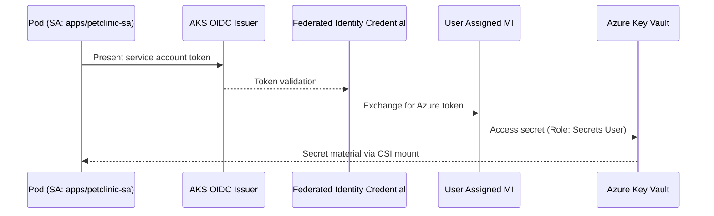
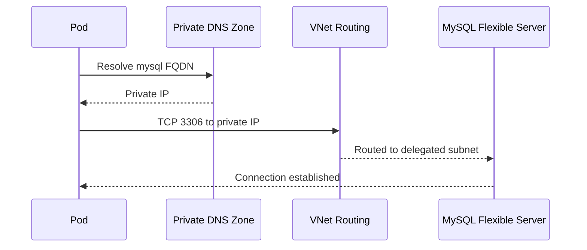

# PetClinic on Azure — Detailed Architecture & Design

> **Scope:** This README describes the target architecture that is provisioned by the Terraform codebase (`tf-az-infraprovison`). It covers Azure resources, networking, identity & RBAC, security, scalability, and operational considerations. All names are parameterized by `var.name_prefix` unless otherwise stated.

> **Note:** The design below reflects the intended state encoded in Terraform.

---

## 1) Overview

The PetClinic application is deployed on **Azure Kubernetes Service (AKS)** and integrates with **Azure Container Registry (ACR)** for images, **Azure Key Vault (KV)** for secrets (via **CSI driver + workload identity**), **Azure Monitor (Log Analytics + Application Insights)** for observability, and **Azure Database for MySQL – Flexible Server** for persistence. Network isolation is achieved using a dedicated **VNet** with separate subnets for AKS, apps, and database. Identity is managed through **Azure AD** with **OIDC-based Workload Identity** and least-privilege RBAC on ACR and Key Vault.

**Key principles**
- **Security by design:** AAD-backed AKS, local accounts disabled, KV CSI with rotation, private MySQL access through Private DNS, Azure Policy enabled.
- **Scalability:** AKS node pool autoscaling.
- **Separation of concerns:** App tier on AKS; data tier on MySQL; platform services (ACR, KV, LA, App Insights) decoupled for lifecycle independence.

---

## 2) Solution Architecture

### 2.1 Logical Architecture



### 2.2 Network Topology



### 2.3 Identity & RBAC



### 2.4 Key Sequences

#### a) Image Pull (ACR)


#### b) Secret Mount (Key Vault CSI + Workload Identity)


#### c) DB Connection (Private)


---

## 3) Resource Inventory

| # | Azure Resource | Type | Name Pattern | Key Settings (Highlights) | Terraform Path |
|---|---|---|---|---|---|
| 1 | Resource Group(s) | `azurerm_resource_group` | `${name_prefix}-rg-*` | Region `${var.location}`, tags applied | root & modules |
| 2 | Virtual Network | `azurerm_virtual_network` | `${name_prefix}-vnet` | CIDR `10.60.0.0/16` | `modules/network/vnet` |
| 3 | Subnet (AKS) | `azurerm_subnet` | `snet-aks` | `10.60.1.0/24` | `modules/network/vnet` |
| 4 | Subnet (App) | `azurerm_subnet` | `snet-app` | `10.60.2.0/24` | `modules/network/vnet` |
| 5 | Subnet (MySQL) | `azurerm_subnet` | `snet-mysql` | `10.60.3.0/24`, **delegated** | `modules/network/vnet` |
| 6 | NSGs | `azurerm_network_security_group` | `${name_prefix}-nsg-*` | Baseline rules; extend as needed | `modules/network/vnet` |
| 7 | Private DNS | `azurerm_private_dns_zone` | `privatelink.mysql.database.azure.com` | Linked to VNet | `modules/network/private-dns-zone` |
| 8 | AKS Cluster | `azurerm_kubernetes_cluster` | `${name_prefix}-aks` | **AAD-enabled**, **local accounts disabled**, **Azure Policy enabled**, **OIDC issuer**, **KV CSI w/ rotation**, OMS agent to LA | `modules/containerapps/_replaced-with-aks` |
| 9 | AKS Node Pool | `default` | `system` | `Standard_D2s_v5`, autoscale **1–2** | `modules/containerapps/_replaced-with-aks` |
|10 | ACR | `azurerm_container_registry` | `${name_prefix}acr` | SKU **Premium**, admin **disabled** | `modules/shared/containerRegistry` |
|11 | Key Vault | `azurerm_key_vault` | `${name_prefix}-kv` | **RBAC enabled**, purge protection **on**, public network **enabled** (recommend PE) | `modules/shared/keyvault` |
|12 | Log Analytics | `azurerm_log_analytics_workspace` | `${name_prefix}-law` | Retention per module defaults | `modules/shared/logAnalytics` |
|13 | App Insights | `azurerm_application_insights` (workspace-based) | `${name_prefix}-appi` | Connected to Log Analytics | `modules/shared/applicationInsights` |
|14 | MySQL Flexible | `azurerm_mysql_flexible_server` | `${name_prefix}-mysql` | SKU **B_Standard_B2s**, 32GB, backups 7d, **private** | `modules/database/mysql` |
|15 | MySQL Admin Secret | `azurerm_key_vault_secret` | `mysql-admin-password` | Generated (`random_password`) | `modules/database/mysql` |
|16 | UAMI (Workload) | `azurerm_user_assigned_identity` | `${name_prefix}-uami` | Federated w/ OIDC for SA `apps/petclinic-sa` | `modules/aks/workload-identity` |
|17 | Federated Identity | `azurerm_federated_identity_credential` | `${name_prefix}-fic` | Subject `system:serviceaccount:apps:petclinic-sa` | `modules/aks/workload-identity` |
|18 | RBAC: AcrPull | `azurerm_role_assignment` | (kubelet → ACR) | Pull rights for image downloads | root |
|19 | RBAC: KV Secrets User | `azurerm_role_assignment` | (UAMI → KV) | Secrets read via CSI | `modules/aks/workload-identity` |
|20 | (Optional) Azure OpenAI | `azurerm_cognitive_account` + deployment | `${name_prefix}-aoai` | Disabled by default; add model deployments as needed | `modules/ai/openai` |

> If actual variable names differ, search/replace `${name_prefix}` accordingly.

---

## 4) Networking & Connectivity

- **Addressing**
  - VNet: `10.60.0.0/16`
  - Subnets: `snet-aks` `10.60.1.0/24`, `snet-app` `10.60.2.0/24`, `snet-mysql` `10.60.3.0/24` (delegated for MySQL)
- **Name Resolution**
  - Private access to MySQL via **Private DNS zone** `privatelink.mysql.database.azure.com` linked to the VNet.
- **Egress**
  - ACR and Key Vault are public by default in this baseline. See security recommendations for **Private Endpoints** and firewall hardening.
- **Ingress**
  - This baseline does not prescribe a specific ingress controller/WAF. If Internet ingress is required, add **NGINX Ingress** or **Application Gateway Ingress Controller (AGIC)** with **WAF** and DNS records.

---

## 5) Identity, Access & Secrets

- **Cluster Access**
  - AKS uses **Azure AD**; **local accounts are disabled**.
  - Admin rights to cluster controlled via `aad_admin_group_object_ids`.
- **Workload Identity**
  - **OIDC** enabled on AKS; a **Federated Identity Credential** binds SA `system:serviceaccount:apps:petclinic-sa` to a **User-Assigned Managed Identity**.
  - Pods authenticate to Azure without node-level secrets.
- **Secrets**
  - Secrets are **mounted via Key Vault CSI**. The UAMI has **Key Vault Secrets User** role.
  - MySQL admin password is **auto-generated** and **stored in Key Vault** (`mysql-admin-password`).
- **Registry Access**
  - The **kubelet identity** has **AcrPull** on the ACR to pull images.

---

## 6) Security Posture

### Strengths
- **AAD-integrated AKS** with **local accounts disabled**.
- **Azure Policy** enabled at cluster creation.
- **Workload Identity + KV CSI** (no long-lived secrets in cluster).
- **Private MySQL** with VNet integration and Private DNS.
- **RBAC** enforced for ACR and Key Vault.

### Prod Deployment Recommendations
1. **Key Vault public network access** is enabled in baseline → **Enable Private Endpoint**, disable public access, and restrict firewall to trusted ranges.
2. **ACR** is public by default → with **Premium**, enable **Private Endpoint** and disable public access where feasible.
3. **Ingress hardening** → Use **App Gateway WAF** or NGINX Ingress + WAF in front; terminate TLS with managed certs; restrict source IPs where applicable.
4. **Node pool separation** → Add **user node pools** (e.g., `workload`, `system`) with taints/tolerations; consider **spot** for non-critical workloads.
5. **Image security** → Enable **Microsoft Defender for Containers** and CI image scanning (e.g., Trivy/GHAS). Enforce signed images (Notary/Azure Policy).
6. **DB resilience** → Current SKU is Basic-class. For production, enable **zone redundancy/HA**, increase vCores/storage, and enforce server parameter hardening.
7. **Network controls** → Tighten **NSG rules**, consider **Azure Firewall** for egress control and FQDN allowlisting (ACR/KV endpoints).
8. **Secret rotation** → Automate rotation to be scoped (DB creds, app secrets).

---

## 7) Scalability & Resilience

- **AKS**
  - System pool autoscaling **1–2** nodes. Add dedicated **user pools** for application workloads.
  - Use **Horizontal Pod Autoscaler (HPA)** based on CPU/RAM/requests per second; optionally **VPA** for right-sizing.
  - For multi-AZ resilience, enable **zone spread** and **PodDisruptionBudgets**.
- **MySQL Flexible**
  - Scale up vCores/storage online; enable HA and zone redundancy for production SLAs.
  - Backup retention currently **7 days**; align with RPO/RTO requirements.
- **Observability pipeline**
  - Log Analytics & App Insights scale elastically; control cost via sampling, retention, and dedicated clusters as needed.

---

## 8) Observability

- **Logs & Metrics**
  - **Container/Node/Cluster logs** shipped to **Log Analytics** (via OMS agent/AMA per module).
  - **Application telemetry** to **Application Insights** (use SDK/OTel exporters).
- **Dashboards & Alerts (examples)**
  - AKS health: node readiness, pod restarts, HPA activity.
  - App health: request rate/latency, dependency failures, error budget burn.
  - MySQL: CPU/IOPS, slow queries, connections, storage thresholds.
  - Alerts via Action Groups to on-call channels (email/Teams/PagerDuty).

---

## 9) Delivery Model (CI/CD & GitOps)

- **Build**
  - Build microservice images, tag (`<repo>:<sha|semver>`), and push to ACR.
- **Deploy**
  - Recommend **Helm** charts and **Argo CD** (or Flux) for GitOps.
  - Use **workload identity** for controllers that need Azure APIs (e.g., External Secrets Operator if used).
- **Config**
  - Store non-secrets in Git (ConfigMaps/values). Store secrets in Key Vault; consume via CSI or External Secrets.

---

## 10) Operations (Day-2)

- **Access management:** Keep cluster admin via AAD groups; rotate membership regularly.
- **Backup & DR:** Verify scheduled backups for MySQL; rehearse restore to DR region; capture RTO/RPO.
- **Patching:** Use AKS auto-upgrade channels or scheduled upgrade windows; enforce node image upgrades.
- **Cost management:** Tag all resources; set budgets/alerts; right-size node pools and MySQL tiers.
- **Runbooks:** Incident response for image pull failures, CSI mount errors, DNS resolution issues.

---

## 11) Assumptions / Not in Terraform

- Public ingress, DNS records, certificates, and WAF are **out of scope** here and should be added per environment.
- GitHub/Azure DevOps pipelines, Argo CD controllers, and Helm charts are **managed outside** this Terraform stack.
- Image repositories/namespaces and app telemetry instrumentation are handled by the application teams.

---

## 12) Terraform Mapping (Appendix)

| Area | Azure Resource / Interaction | Key Attributes | Module / File |
|---|---|---|---|
| Network | VNet, Subnets, NSGs | `10.60.0.0/16`; `snet-aks 10.60.1.0/24`; `snet-app 10.60.2.0/24`; `snet-mysql 10.60.3.0/24` (delegated) | `modules/network/vnet` |
| DNS | Private DNS Zone + Link | `privatelink.mysql.database.azure.com` | `modules/network/private-dns-zone` |
| AKS | Cluster | AAD, local accounts **disabled**, Azure Policy, OIDC issuer, KV CSI (rotation), OMS | `modules/containerapps/_replaced-with-aks` |
| Nodes | Default pool | `Standard_D2s_v5`, autoscale **1–2** | `modules/containerapps/_replaced-with-aks` |
| Registry | ACR | SKU **Premium**, admin **disabled** | `modules/shared/containerRegistry` |
| Secrets | Key Vault | **RBAC enabled**, purge protection on, public network **enabled** | `modules/shared/keyvault` |
| Logs | Log Analytics | Workspace-based | `modules/shared/logAnalytics` |
| Tracing | App Insights | Workspace-based | `modules/shared/applicationInsights` |
| DB | MySQL Flexible | SKU **B_Standard_B2s**, 32GB, backups 7d, private | `modules/database/mysql` |
| DB Secret | KV secret | `mysql-admin-password` from `random_password` | `modules/database/mysql` |
| Workload Identity | UAMI + FIC | SA `apps/petclinic-sa` subject; KV role **Secrets User** | `modules/aks/workload-identity` |
| RBAC | ACR pull | **AcrPull** for kubelet identity | root |

---

## 13) How to use and run the Terraform codebase

1. **Prereqs**
   - Azure subscription + Owner or equivalent to create RG/role assignments.
   - Terraform ≥ the version pinned in `versions.tf`.
   - Remote state backend configured as in `backend.tf` (Storage Account, Container, Key).

2. **Initialize Bootstrap Resources**
   ```bash
   cd backend/bootstrap
   terraform init
   terraform apply -auto-approve \
   -var location="<put azure region>" \
   -var rg_name="<put az resource group name >" \
   -var sa_name="<put az storage account name>" \
   -var container_name="<put sa blob container name >" \
   -var subscription_id="$(az account show --query id -o tsv)" \
   -var tenant_id="$(az account show --query tenantId -o tsv)"
   ```

3. **Initialize Remote Backend, Plan and Apply**
   ```bash
   cd tf-az-infraprovison
   terraform fmt -recursive
   terraform init
   terraform validate
   terraform plan \
   -var location="<put azure region>" \
   -var rg_name="<put az resource group name >" \
   -var name_prefix="<put az resources name prefix>" \
   -var 'aad_admin_group_object_ids=["<put aad admin group object id>"]' \
   -var subscription_id="$(az account show --query id -o tsv)" \
   -var tenant_id="$(az account show --query tenantId -o tsv)" \
   -var tf_operator_object_id="$(az ad signed-in-user show --query id -o tsv)" \
   -out tfplan 
   terraform apply -auto-approve "tfplan"
   ```

4. **Kubeconfig & Access**
   ```bash
   az aks get-credentials -g <put az resource group name> -n ${name_prefix}-aks --overwrite-existing
   kubectl get pods ; 
   ```

5. **Build & Deploy Petclinic App on AKS**
   - Build the Petclinic App using Github Actions
   - Push images to ACR.
   - Use Helm/Argo CD to deploy the manifests targeting namespace.
- **Note** — Detailed design along with the exact steps for CI/CD and GitOps using Github Action, Helm, ArgoCD provided in the mentioned task directory.

> **Post-deploy hardening:** Add Private Endpoints for KV/ACR, configure WAF ingress, and finalize NSG/Azure Firewall rules.

---

## 14) Change Log

- **v1.0** — Initial AKS-based design README aligned to `tf-az-infraprovision` modules.
