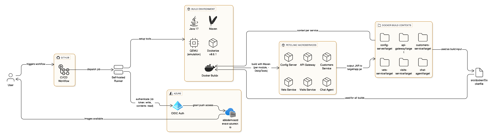

# Build Pipeline — Github Actions Workflow Design

> **Scope:** This README documents the GitHub Actions workflow `abb-demoapp-build-and-push.yaml` that builds, tests, and pushes container images for the PetClinic microservices to **Azure Container Registry (ACR)**. It covers triggers, jobs, matrix strategy, OIDC authentication to Azure, image tagging, and **security controls** including **secret scanning** and **security scanning** (SAST/SCA/container).  
> **Note:** **This workflow considering as CI or Continuous Integration. Continuous Deployment flow should be seperated from CI pipeline. Hence, this pipeline only works as CI**. 

---

## 1) Github Actions High Level Flow



**Key properties**
- **Runner:** `self-hosted` (requires Docker + Buildx, QEMU, Java 17, Maven, Azure CLI).
- **Auth:** OIDC with `azure/login@v2` (`permissions: id-token: write`), **no long-lived secrets**.
- **Registry:** `abbdemoazdevacr.azurecr.io` (ACR name: `abbdemoazdevacr`).  
- **Platforms:** `linux/amd64, linux/arm64` (via Buildx + QEMU).  
- **Tags:** `<reg>/<ns>/<svc>:sha-<github.sha>` and `:latest`.

---

## 2) Triggers, Permissions & Environments

### Triggers
- `push` to `main` or `master`
-  includes a **paths** filter on the workflow file
- `tags: v*`
- `workflow_dispatch` (manual)

### Permissions
- `contents: read`  
- `id-token: write` (required for **OIDC** to Azure)

### Widen trigger paths
Builds when app code changes, include `src/**`, `pom.xml`, etc.:
```yaml
on:
  push:
    branches: [ main, master ]
    paths:
      - ".github/workflows/abb-demoapp-build-and-push.yaml"
      - "src/**"
      - "pom.xml"
```

---

## 3) Job & Matrix

- **runs-on:** `self-hosted`
- **Matrix services:** (based on the workflow)
  - `config-server` → `spring-petclinic-config-server` (port **8888**)
  - `api-gateway` → `spring-petclinic-api-gateway` (port **8080**)
  - `customers-service` → `spring-petclinic-customers-service` (port e.g., **8081**)
  - `vets-service` → `spring-petclinic-vets-service` (port e.g., **8082**)
  - `visits-service` → `spring-petclinic-visits-service` (port e.g., **8083**)
  - `chat-agent` → `spring-petclinic-chat-agent` (port varies)
- **Build context:** `src/${{ matrix.module }}/target`
- **Dockerfile:** `src/docker/Dockerfile`
- **Environment defaults (typical in this workflow):**
  - `JAVA_VERSION=17`
  - `MVN_ARGS='-B -ntp -DskipTests'` *(see test recommendations below)*
  - `ACR_LOGIN_SERVER=abbdemoazdevacr.azurecr.io`
  - `ACR_NAME=abbdemoazdevacr`
  - `IMAGE_NAMESPACE=demo-petclinic-app`
  - `PLATFORMS=linux/amd64,linux/arm64`
  - `DOCKERIZE_VERSION=v0.6.1`

> **Tagging:**  
> `${ACR_LOGIN_SERVER}/${IMAGE_NAMESPACE}/${SERVICE}:sha-${GITHUB_SHA}` and `:latest`

---

## 4) Authentication to Azure & ACR

### OIDC (Entra ID federated credentials)
- The workflow requests an **OIDC token** from GitHub and exchanges it with **Entra ID** via `azure/login@v2` to get an Azure access token.
- The Azure App (client) must be granted **AcrPush** on the target ACR **scope** (prefer registry-level scope only).

**Minimal roles**
- **AcrPush** on `abbdemoazdevacr` (required to push images).
- (Optional) **Reader** on the ACR resource group for discovery.

**ACR login**
- `az acr login --name $ACR_NAME` converts the Azure token into a Docker credential for `docker/build-push-action`.

**Security benefits**
- **No static secrets** in repo/actions.
- **Short‑lived tokens**, automatically rotated per run.
- **Least privilege** via scoped role assignment.

---

## 5) Build & Test

### Java build
- Maven builds each module (matrix). The Dockerfile expects `target/app.jar` and uses build args:
  - `ARTIFACT_NAME=app`
  - `EXPOSED_PORT=${{ matrix.port }}`
  - `DOCKERIZE_VERSION=${{ env.DOCKERIZE_VERSION }}`

### Tests
- Uses `-DskipTests` and fail fast on test failures:
```yaml
- name: Run unit tests
  run: mvn -B -ntp -DskipITs test
```

- Optionally add **integration tests** (spin up compose services or use Testcontainers) and run them before building images:
```yaml
- name: Run integration tests
  run: mvn -B -ntp -DskipUnitTests verify -Pintegration-tests
```

---

## 6) Container Build & Push (Multi-Arch)

- `docker/setup-qemu-action@v3` + `docker/setup-buildx-action@v3` enable **multi-architecture** builds.
- `docker/build-push-action@v6` builds for `${PLATFORMS}` and **pushes a manifest list** to ACR with tags `sha-<commit>` and `latest`.

---

## 7) Security & Compliance

This section describes the **checks are in place** and **how they ensure security**, split into: **secret scanning**, **code/dependency scanning (SAST/SCA)**, **container image scanning**, **signing**.

### 7.1 Secret Management & Secret Scanning

**In place**
- **OIDC to Azure** → eliminates PATs/registry passwords in CI.
- **No hard-coded secrets** in the pipeline (should be enforced by review).

1. **GitHub Secret Scanning & Push Protection** (repo settings)  
   - Detects committed credentials (tokens, keys) and **blocks pushes** with known token formats.
2. **Gitleaks** (action) — blocks generic secrets patterns:
```yaml
- name: Secret scan (gitleaks)
  uses: gitleaks/gitleaks-action@v2
  with:
    args: "--no-banner --redact --verbose --exit-code 1"
```
3. **TruffleHog** (alternative/extra patterns):
```yaml
- name: Secret scan (trufflehog)
  uses: trufflesecurity/trufflehog@v3
  with:
    path: "."
    extra_args: "--exclude_paths .gitignore --fail"
```

**Why this helps**
- Catches **accidental secret leaks** early; **fails the build** so compromised keys don’t ship.
- Push Protection prevents leaks from ever landing on default branches.

### 7.2 Code & Dependency Security (SAST/SCA)

1. **CodeQL** (Java): Find code-level vulnerabilities (SAST).  
```yaml
- name: Initialize CodeQL
  uses: github/codeql-action/init@v3
  with:
    languages: java
- name: Perform CodeQL Analysis
  uses: github/codeql-action/analyze@v3
```
2. **Dependency Audit** (SCA): flag vulnerable libs.
   - **Maven**: `mvn -B -ntp org.owasp:dependency-check-maven:check -DfailBuildOnCVSS=7.0`

**Gating**
- Configuration **required status checks** on `main` so PRs cannot merge unless CodeQL & SCA pass.

### 7.3 Container Image Security

1. **Dockerfile lint** (Hadolint) — catches insecure base images and practices:
```yaml
- name: Lint Dockerfile (hadolint)
  uses: hadolint/hadolint-action@v3.1.0
  with:
    dockerfile: src/docker/Dockerfile
```
2. **Image vulnerability scan** (Trivy) — blocks known CVEs:
```yaml
- name: Trivy scan (image)
  uses: aquasecurity/trivy-action@0.24.0
  with:
    image-ref: ${{ steps.img.outputs.reg }}/${{ steps.img.outputs.ns }}/${{ matrix.name }}:sha-${{ github.sha }}
    format: 'table'
    vuln-type: 'os,library'
    exit-code: '1'
    severity: 'HIGH,CRITICAL'
```

**Why this helps**
- Prevents shipping images with **HIGH/CRITICAL CVEs**.

### 7.4 Signing

**Recommendation**
- **Cosign keyless signing** using GitHub OIDC; store signatures alongside images in ACR.
```yaml
- name: Install Cosign
  uses: sigstore/cosign-installer@v3.6.0

- name: Sign image (keyless)
  env:
    COSIGN_EXPERIMENTAL: "true"
  run: |
    cosign sign --yes ${{ steps.img.outputs.reg }}/${{ steps.img.outputs.ns }}/${{ matrix.name }}:sha-${{ github.sha }}
```

**Why this helps**
- Consumers (e.g., AKS admission controllers) can verify images were produced by **your** pipeline and **untampered**.

---

## 8) Quality Gates & Branch Protections

- **Required status checks**: CodeQL, Gitleaks, Trivy, Unit tests.
- **Branch protection**: require PRs, code reviewer approvals, and **branch protection**.
- **Environment protections** (if using environments): require approvals for “prod” deploys.
- **Fail-fast policy**: make security steps fail the job on HIGH/CRITICAL findings.

---

## 9) Runner Requirements

Ensure the self-hosted runner has:
- Docker 24+ with Buildx; QEMU emulation
- Java 17; Maven
- Azure CLI
- Network egress to `*.azurecr.io` and GitHub endpoints
- Sufficient disk for multi-arch layer caching

---

## 10) Change Log
- **v1.0** — Initial pipeline design doc with security scanning & secret scanning.
