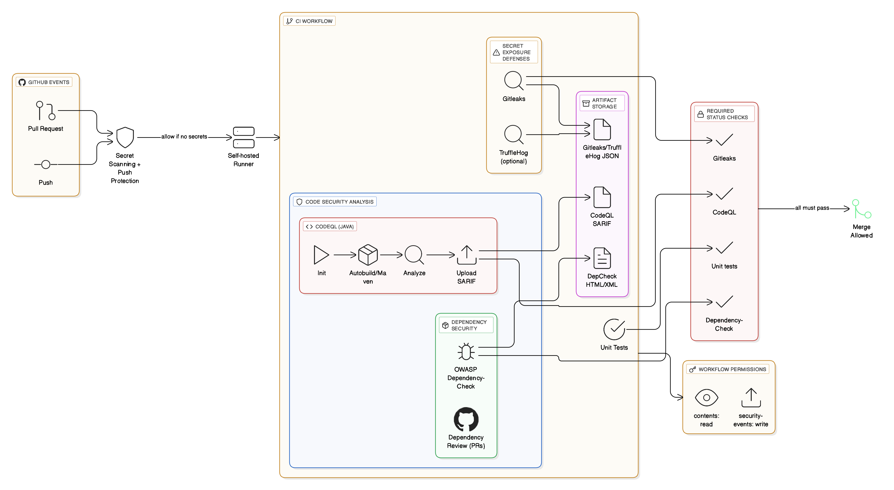

# Secrets Scanning & Code Security

> **Scope:** This documents describes the **secret scanning** and **code security analysis** implemented in the CI/Build action workflow. It is designed with the usage of **GitHub Advanced Security (GHAS)** which uses scanners and gates to block risky changes.

---

## GitHub Advanced Security

GitHub Advanced Security for secret scanning and code security analysis capabilities:

- **GitHub Secret Protection** — features to help detect and prevent secret leaks, such as **secret scanning** and **push protection**.
- **GitHub Code Security** — features to help find and fix vulnerabilities, like **code scanning**, **premium Dependabot features**, and **dependency review**.
- GitHub makes **extra security features** available to customers who purchase GitHub Code Security or GitHub Secret Protection.

> **Please note, GitHub’s Advanced Security products i.e. secret scanning and code security analysis for private repo can't be enabled until license is purchased. However, the equivalent coverage can be implemented using open‑source tools and branch protections for private repos.**

---

## 1) High‑Level Architecture



**Key points**
- Triggers on `pull_request`(this is must for prod deployment; not demonstrated in this pipeline),`push`.
- **Self‑hosted** runner executes all scans.

## Below options will be visible once GitHub Advanced Security enabled and respective options to be turned on accordingly.


---

## 2) Security Checks & Gates (implementation and controls)

1) Static Security Check job (`security_static`) runs **first** on a self-hosted runner and includes:

   - **Secret scanning – Gitleaks:** executed with `--exit-code 1` so any detected secret fails the job. 
   - **SAST – CodeQL (Java):** initializes, performs a Maven build on Java 17, and runs analysis; results are uploaded to GitHub Code Scanning using `security-events: write.`

2) **Gating:** The Build & Push job declares `needs: [security_static]`, so container images are **not built or pushed** unless the security job completes successfully.

3) **Cloud auth:** The pipeline uses `permissions: id-token: write` and `azure/login@v2` to obtain a short-lived token, then `az acr login` to push images to `abbdemoazdevacr.azurecr.io`. No registry passwords or static cloud keys are stored in the workflow.

4) **Reporting & Gates**  
   - Return **non‑zero exit codes** to fail the job on HIGH/CRITICAL findings.  
   - For productio  deployments, **branch protection** to be enforced so PRs cannot merge unless all required checks pass. **In current pipeline, if any vulnerabilities or secrets are detected, the build/push job will not be triggered and it will be blocked for any deployments.**
  
5) **Secrets exposure (hard fail):** Gitleaks scans the repo; any match results in a failed job and the pipeline stops before build/push. Evidence is in job logs; maintainers must triage and fix the alert/issue.

6) **Source-code vulnerabilities (SAST):** CodeQL analyzes the Java codebase and uploads alerts to GitHub’s Code Scanning. The job itself succeeds if analysis completes, but the build is still gated behind security_static. We recommend marking CodeQL as a required status check on the default branch so PRs cannot merge while unresolved alerts exist.

---

## 3) Security Configuration

- Below demonstrates the use of GitHub Advanced Security for secret scanning and code security analysis in the actions workflow.

```yaml

# Static security checks

jobs:
  security_static:
    name: Static Security Check
    runs-on: self-hosted
    permissions:
      contents: read
      actions: read
      security-events: write
      id-token: write
    steps:
      - name: Checkout
        uses: actions/checkout@v4

      # Secret scanning (gitleaks)
      - name: Secret scan (gitleaks)
        uses: gitleaks/gitleaks-action@v2
        with:
          args: "--no-banner --redact --verbose --exit-code 1"
      
     # JDK 17 on the runner for Maven to use
      - name: Set up Temurin 17
        uses: actions/setup-java@v4
        with:
          distribution: temurin
          java-version: '17'
          cache: maven

      # SAST (CodeQL) — Java
      - name: Initialize CodeQL
        uses: github/codeql-action/init@v3
        with:
          languages: java

      # Manual build for CodeQL
      - name: Build (manual for CodeQL on Java 17)
        working-directory: src
        run: |
          mvn -v
          mvn -B -ntp -DskipTests clean package

      - name: Perform CodeQL Analysis
        uses: github/codeql-action/analyze@v3
```
---

## 3) Change Log
- **v1.0** — Initial design for secret & code security scanning with GHAS.
