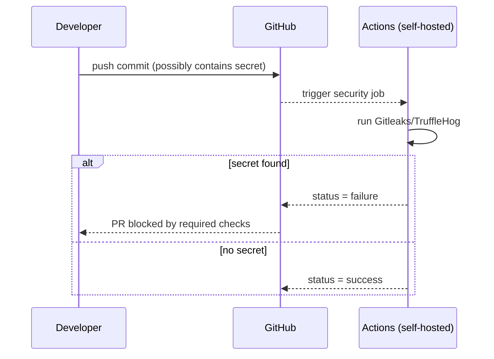
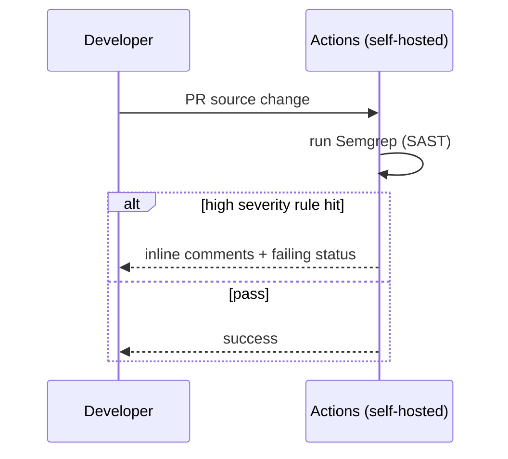

# Secrets & Code Security in GitHub Actions — Detailed Design (No GHAS Edition)

> **Scope:** This README documents how the repository’s CI runs **secret scanning** and **code security analysis** _before_ any container build/push. It is designed for **private repos without GitHub Advanced Security (GHAS)** and uses open‑source scanners and CI gates to block risky changes.

---

## 0) Product & Licensing Notice (as requested)

Some capabilities **require purchase** of GitHub’s Advanced Security products:

- **GitHub Secret Protection** — features to help detect and prevent secret leaks, such as **secret scanning** and **push protection**.
- **GitHub Code Security** — features to help find and fix vulnerabilities, like **code scanning**, **premium Dependabot features**, and **dependency review**.
- GitHub makes **extra security features** available to customers who purchase GitHub Code Security or GitHub Secret Protection. **GitHub Code Security** and **GitHub Secret Protection** are available for accounts on **GitHub Team** and **GitHub Enterprise Cloud**.

> **Hence**, this CI pipeline is designed to operate **without GitHub’s Advanced Security products** (No‑GHAS). We implement equivalent coverage using open‑source tools and strict branch protections.

---

## 1) High‑Level Architecture

```mermaid
flowchart LR
  Dev[Developer] -->|push/PR| GH[GitHub]
  GH --> Runner[GitHub Actions (self-hosted runner)]
  subgraph Security Scans on Runner
    GL[Gitleaks (secrets)]
    TH[TruffleHog (optional)]
    SG[Semgrep (SAST)]
    DC[OWASP Dependency-Check (SCA)]
    HL[Hadolint (Dockerfile lint)]
    TV[Trivy (repo/FS scan)]
  end
  Runner --> Artifacts[Build artifacts: JSON/HTML/XML reports]
  SG --> Report[PR annotations / summary]
  DC --> Artifacts
  GL --> Artifacts
  TH --> Artifacts
  TV --> Artifacts
  HL --> Artifacts
  Artifacts --> Review[Human review + required status checks]
```

**Key points**
- Triggers on `pull_request` and `push` (to default branches).
- **Self‑hosted** runner executes all scans.
- **Required status checks** gate merges (no GHAS required).

---

## 2) Pipeline Stages & Gates

1) **Checkout & environment prep**  
   Sets up Java/Maven (for Java repos) and any language‑specific tooling.

2) **Secret scanning (CI)**  
   - **Gitleaks**: scans repository (and optionally history) for secrets, fails on any finding.  
   - **TruffleHog** (optional): additional patterns for robustness.

3) **Static App Security Testing (SAST)**  
   - **Semgrep** (OSS rules for Java): fast source analysis; annotates PRs and fails on high‑severity findings.  
   - **SpotBugs** (optional, via Maven) can be added for Java bytecode analysis.

4) **Software Composition Analysis (SCA)**  
   - **OWASP Dependency‑Check**: flags vulnerable dependencies using NVD/OSS Index; **fails** if CVSS ≥ 7.0.  
   - (Optional) **OSV Scanner** for additional coverage.

5) **Dockerfile hygiene (pre‑build)**  
   - **Hadolint** to catch insecure Dockerfile practices before images are built.

6) **Repository vulnerability scan (optional)**  
   - **Trivy fs** mode scans the working tree for known CVEs in vendored binaries & SBOM content.

7) **Reporting & Gates**  
   - Save reports as **Actions artifacts** (JSON/HTML/XML).  
   - Return **non‑zero exit codes** to fail the job on HIGH/CRITICAL findings.  
   - Enforce **branch protection** so PRs cannot merge unless all required checks pass.

---

## 3) CI Implementation — Example Steps (drop‑ins)

> Keep these in a dedicated job that runs **before** build/push jobs.

```yaml
name: security-checks

on:
  pull_request:
  push:
    branches: [ main, master ]

permissions:
  contents: read  # enough for these steps (no GHAS code scanning upload used)

jobs:
  security:
    runs-on: self-hosted

    steps:
      - name: Checkout
        uses: actions/checkout@v4

      - name: Set up Java (for Java repos)
        uses: actions/setup-java@v4
        with:
          distribution: temurin
          java-version: '17'

      # ---------- Secret Scanning ----------
      - name: Secret scan (gitleaks)
        uses: gitleaks/gitleaks-action@v2
        with:
          args: "--no-banner --redact --verbose --exit-code 1"

      - name: Secret scan (trufflehog) # optional
        uses: trufflesecurity/trufflehog@v3
        with:
          path: "."
          extra_args: "--exclude_paths .gitignore --fail --only-verified"

      # ---------- SAST ----------
      - name: Semgrep (SAST)
        uses: returntocorp/semgrep-action@v1
        with:
          config: "p/ci"
          generateSarif: false
          publishToken: ""
          auditOn: "push"
          comment: true
        env:
          SEMGREP_APP_TOKEN: ""  # leave empty to avoid external uploads

      # (Optional) SpotBugs
      - name: SpotBugs (optional)
        run: mvn -B -ntp com.github.spotbugs:spotbugs-maven-plugin:check || true
        # Use || true initially; later remove to gate on SpotBugs findings

      # ---------- SCA ----------
      - name: OWASP Dependency-Check (SCA)
        run: mvn -B -ntp org.owasp:dependency-check-maven:check -DfailBuildOnCVSS=7.0

      # ---------- Dockerfile hygiene ----------
      - name: Lint Dockerfile (hadolint)
        uses: hadolint/hadolint-action@v3.1.0
        with:
          dockerfile: src/docker/Dockerfile

      # ---------- Optional repo FS vuln scan ----------
      - name: Trivy filesystem scan (optional)
        uses: aquasecurity/trivy-action@0.24.0
        with:
          scan-type: 'fs'
          scan-ref: '.'
          format: 'table'
          vuln-type: 'os,library'
          exit-code: '1'
          severity: 'HIGH,CRITICAL'

      # ---------- Artifacts ----------
      - name: Upload reports (if generated)
        uses: actions/upload-artifact@v4
        with:
          name: security-reports
          path: |
            target/dependency-check-report.*
            semgrep.sarif
            **/gitleaks*.json
            **/trivy*.txt
          if-no-files-found: ignore
```

**Why this works without GHAS**
- All scanners **run locally** on the runner and **fail the job** if they find HIGH/CRITICAL issues.  
- **Branch protection** settings make these checks **required**; PRs cannot merge until they pass.

---

## 4) Failure Logic & Required Checks

We recommend marking these as **required status checks** on the default branch:
- `Secret scan (gitleaks)`
- `Semgrep (SAST)`
- `OWASP Dependency-Check (SCA)`
- `Lint Dockerfile (hadolint)`
- `Unit tests` (from your build job)

> You can start permissive (warn-only) and later make them blocking by removing `|| true` or adjusting severities.

---

## 5) Sequences (What happens when…)

### A) Push a secret (No‑GHAS)


### B) Open PR with vulnerable dependency
```mermaid
sequenceDiagram
  participant Dev as Developer
  participant GH as GitHub
  participant CI as Actions (self-hosted)
  Dev->>GH: open/update PR
  GH-->>CI: trigger security job
  CI->>CI: run Dependency-Check (SCA)
  alt CVSS >= 7.0
    CI-->>GH: status = failure
    GH-->>Dev: PR blocked; fix/upgrade required
  else low/none
    CI-->>GH: status = success
  end
```

### C) PR introduces risky code pattern (SAST)


---

## 6) Results, Storage & Visibility

- **Artifacts**: Upload scanner outputs (JSON/HTML/XML) for audit. Set retention in repo settings.  
- **PR Comments**: Semgrep can **comment inline** without uploading SARIF to GHAS.  
- **Dashboards**: Optionally have CI post a summary table in the PR description (e.g., via a custom script).  
- **SIEM**: Export artifacts on job success/failure to long‑term storage if needed.

---

## 7) Tuning, Exceptions & Governance

- **Severity thresholds**: Start with `HIGH,CRITICAL` as blocking; progressively include `MEDIUM`.
- **Allowlists**: Maintain a `gitleaks.toml` for known false-positives; reviewed periodically.  
- **Baselines**: For legacy repos, generate baselines and only fail on **new** issues.  
- **License policy**: Use SBOM (Syft) + policy gate (e.g., deny GPL‑3.0) if needed.  
- **Change control**: Security step changes via PR only; owners approve (CODEOWNERS).

---

## 8) Limitations without GHAS & Mitigations

- **No server‑side Push Protection** → secrets can reach the remote.  
  *Mitigate with pre‑commit hooks (Gitleaks), and CI blocks before merge.*  
- **No Code Scanning Alerts UI** (SARIF) for private repos → rely on PR comments, artifacts, and required checks.  
- **No premium Dependabot/Dependency Review** → OWASP Dependency‑Check/OSV Scanner provide coverage; consider enabling free Dependabot alerts if available.  

---

## 9) Quick Checklist (to go live)

- [ ] Add the **security-checks** job to your CI.  
- [ ] Configure **branch protection** with required checks.  
- [ ] Store **artifacts** and set retention.  
- [ ] Add `gitleaks.toml` and Semgrep rule tuning as needed.  
- [ ] Socialize the failure policy (how to request exceptions).

---

## 10) Change Log
- **v1.0** — Initial design for secret & code security scanning without GHAS.