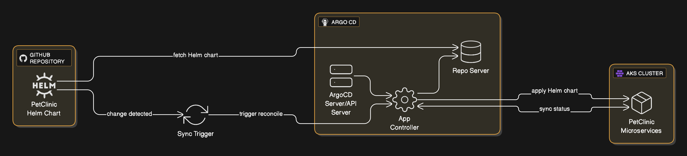

# GitOps with Argo CD on AKS — Helm-Based Deployments

This document explains how **Argo CD** automates deployments of kubenetes manifest files using **Helm charts** to **Azure Kubernetes Service (AKS)**, with **version tracking**, **rolling back** reliably.

---

## 1) Overview and Architecture

Argo CD is a declarative, GitOps continuous delivery tool for Kubernetes. Argo CD follows the GitOps pattern of using Git repositories as the source of truth for defining the desired application state.

Argo CD automates the deployment of the desired application states in the specified target environments. Application deployments can track updates to branches, tags, or be pinned to a specific version of manifests at a Git commit.

**High Level GitOps Flow:**




**ArgoCD helps with:**
- **Continuous deployment (CD)**: watches Git repository for changes to the **Helm chart** and **values**; on change, **renders** and **syncs** to the kubernetes cluster.
- **Versioned deployments**: every deployed state maps to a **Git commit/Helm revision** (visible in Argo CD UI & history).
- **Self-healing**: if runtime drift occurs (manual change), Argo CD restores the **desired state** from Git.
- **Pruning**: removes objects that no longer exist in Git (prevents config drift/orphans).
- **Rollback**: revert to any prior **Git commit** or **Application history** entry with one command or click.

---

## 2) Prerequisites

- kubectl access to AKS cluster.
- Helm 3.x installed locally.
- (Private repos) a **GitHub Personal Access Token** with **read-only** access to the repo..

---

## 3) Install Argo CD on AKS

Create the Argo CD namespace and install the official manifests:
```bash
kubectl create namespace argocd
kubectl apply -n argocd -f https://raw.githubusercontent.com/argoproj/argo-cd/stable/manifests/install.yaml
```

Get the initial **admin** password (auto-generated secret):
```bash
kubectl -n argocd get secret argocd-initial-admin-secret -o jsonpath="{.data.password}" | base64 -d; echo
```

Expose the Argo CD API/UI:
- **Use a LoadBalancer service:**
  ```bash
  # Make the service is a LoadBalancer with BOTH 80 and 443 going to 8080
  kubectl -n argocd expose svc argocd-server --type=LoadBalancer --name=argocd-server-lb --port 80 --target-port 8080
  kubectl -n argocd patch svc argocd-server \
  -p '{"spec":{"type":"LoadBalancer","ports":[
    {"name":"http","port":80,"targetPort":8080},
    {"name":"https","port":443,"targetPort":8080}
  ]}}'
  ```
  ```bash
  # watch until EXTERNAL-IP shows up
  kubectl -n argocd get svc argocd-server
  ```
- AKS will provision a public IP on the cluster’s Standard Load Balancer and attach it to the service; use that IP to reach the UI.
  
---

## 4) Connect Argo CD to Your GitHub Repo (PAT)

**In Argo CD UI**
- Log in to Argo CD.
- Go to Settings → Repositories → CONNECT REPO → HTTPS.

**Fill in:**
- Repository URL: `https://github.com/<owner>/<repo name>.git`
- Username: `<github username>`
- Password: `<put github PAT>`
- (Optional) Name: a friendly name for the repo
- Click Connect. You should see the repo show up with a green/“successful” status.


> Scope the PAT to **read-only** repository access with below permissions:

- **Content:** Repository contents, commits, branches, downloads, releases, and merges (aceess to be enabled)
- **Metadata:** Search repositories, list collaborators, and access repository metadata. (enabled by default)

---

## 5) How Versioned Deployments Work

Argo CD ties cluster state to a **Git revision**:
- `spec.source.targetRevision` can be:
  - A **branch** (e.g., `main`) → always deploy the latest commit on that branch.
  - A **tag** (e.g., `v1.2.3`) → deploy that **fixed version**.
  - A **commit SHA** → deploy an exact commit.
- With **Helm**, your **values files** (or chart version if using an external chart repo) encode the **image tag** and settings.
- For **environment promotion**, use Git branches or folders (`dev`, `stage`, `prod`) and promote via **pull request** (Git becomes the change control).

**Example values (snippet)** pinning an image tag:
```yaml
image:
  repository: abbdemoazdevacr.azurecr.io/demo-petclinic-app/api-gateway
  tag: "sha-<commit-sha>"   # or "1.0.7"
```

---

## 6) Automatic Sync from GitHub Changes

**Polling (default):** Argo CD periodically polls repos and detects new commits.

With **Automated Sync** enabled, Argo CD applies the new manifests as soon as the change is detected.


---

## 7) Rollouts and Health

- Argo CD waits for **health**: Deployments become **Healthy** when pods pass readiness/liveness probes.
- Use **HPA/PDB** (from your Helm chart) to maintain SLOs during rolling updates.
- Configure **Sync Waves** and **hooks** in Helm (pre/post sync) for ordered changes (DB migrations, etc.).

---

## 8) Rollback Strategies

**Git Revert (recommended)**
- Revert/rollback the problematic commit in Git (values/chart).
- Argo CD detects the new desired state and reconciles the cluster.

---

## 9) Troubleshooting

- **Repo access errors**: recheck PAT permissions.
- **Sync failures**: view app events/logs; `kubectl describe` failed objects.

---

## 10) Change Log
- **v1.0** — Initial Argo CD GitOps README for AKS with Helm, versioning, and rollback.
